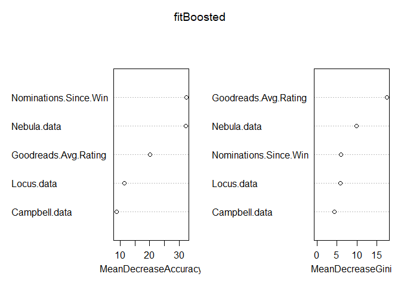

Prediction and Analysis
================
Tommy Tang
November 20, 2017

Prediction and Analysis
-----------------------

Now that we have clean data. Let us begin implementing the prediction and analysis for the Hugo Awards. Scripts and detailed explanations can be found in the analysis.R script. We will build a model and test our predictor on the most recent six years.

First let us load the data from the HugoComplete.

Now, if we check the beginning of the data:

``` r
head(data, 10)
```

    ##     X Year             Author
    ## 1   1 1966      Frank Herbert
    ## 2   2 1966      Roger Zelazny
    ## 3   3 1966       John Brunner
    ## 4   4 1966 Robert A. Heinlein
    ## 5   5 1966    Edward E. Smith
    ## 6   6 1967 Robert A. Heinlein
    ## 7   7 1967   Samuel R. Delany
    ## 8   8 1967    Randall Garrett
    ## 9   9 1967       Daniel Keyes
    ## 10 10 1967   James H. Schmitz
    ##                                                  Title
    ## 1                                                 Dune
    ## 2  ...And Call Me Conrad (also known as This Immortal)
    ## 3                              The Squares of the City
    ## 4                 The Moon Is a Harsh Mistress[Note 2]
    ## 5                                     Skylark DuQuesne
    ## 6                 The Moon Is a Harsh Mistress[Note 2]
    ## 7                                             Babel-17
    ## 8                                   Too Many Magicians
    ## 9                                 Flowers for Algernon
    ## 10                               The Witches of Karres
    ##                                 Publisher.s. Winner Locus.data Nebula.data
    ## 1                            Chilton Company   TRUE          0           2
    ## 2  The Magazine of Fantasy & Science Fiction   TRUE          0           0
    ## 3                           Ballantine Books  FALSE          0           0
    ## 4                                         If  FALSE          0           0
    ## 5                                         If  FALSE          0           0
    ## 6                                         If   TRUE          0           0
    ## 7                                  Ace Books  FALSE          0           2
    ## 8              Analog Science Fact & Fiction  FALSE          0           0
    ## 9                  Harcourt Trade Publishers  FALSE          0           2
    ## 10                           Chilton Company  FALSE          0           0
    ##    Campbell.data Goodreads.Avg.Rating Goodreads.Number.of.Ratings
    ## 1              0                 4.19                      531443
    ## 2              0                   NA                          NA
    ## 3              0                 3.38                         472
    ## 4              0                   NA                          NA
    ## 5              0                   NA                          NA
    ## 6              0                   NA                          NA
    ## 7              0                 3.78                        8844
    ## 8              0                 3.92                         786
    ## 9              0                 4.07                      340564
    ## 10             0                 4.17                        2052

we see that there are quite a few zeros for awards. What gives? Well, the Hugos are the oldest awards and began before any of the other ones. This will unfairly weight those awards with smaller weight - this is suboptimal, considering that the voting committees will be similar and the Locus Awards were created with the explicit goal of influencing the Hugos. These were split into the Locus SF and Locus Fantasy awards in 1978.

Thus we will take a recent sample of the data:

``` r
data <- data[65:271,]
```

Now we break up our data in the training and test sets. The test set will be the winner data from 2012-2017. Since the earliest entry in which the year is 2012 is begins at 176, and the remaining data has 208 entries:

``` r
which(data$Year == 2012)
```

    ## [1] 176 177 178 179 180

``` r
length(data$Year)
```

    ## [1] 207

we will want to subset accordingly:

The data broken up successfully, we now build our model. There are between 5-6 nominees every year, so if we can get more than one guessed successfully, we will be a bit happy.

First, let's try a Naive Bayes predictor (maximum likelihood).

A quick and dirty random forest:

``` r
fit <- randomForest(as.factor(Winner) ~ Locus.data + Nebula.data + Campbell.data + Goodreads.Avg.Rating, data = training, importance = TRUE, ntree = 2000)
test$probabilities <- predict(fit, test, type = "prob")[,2]
pred <- predictWinners(test)
```

Let's compare:

``` r
correctGuesses <- as.logical(pred) * test$Winner
sum(correctGuesses)
```

    ## [1] 1

Now, this is better than a random guess, but let's try to do better. In particular, we realize that we have not used information about the authors.

In basketball and in the Oscars, there is this concept of the make-up call. That is, if a player or filmmaker or actor is snubbed one year, they will be awarded at another point with a call in their favor.

That is, if an author has received many nominations without a win, will they be more likely to receive a win in their subsequent nomination? It seems useful, then to consider the awards for "Best Short Story", "Best Novelette", and "Best Novella" as well, since there will always be a bit of behind-the-scenes networking and discussions that we are not privy to.

All this to say, it will be useful to conglomerate the awards data by author.

We will add the following pieces of data to each title: "Number of Nominations Since Previous Win"; "Previous Best Novel Nominations; "Previous Short Story, Novella, or Novelette Nominations". The first category is limited to the Hugos, whereas we will not limit the latter two counts.

Here we make use of the the getNoms function from analysis.R.

Check it:

``` r
str(training)
```

    ## 'data.frame':    175 obs. of  12 variables:
    ##  $ X                          : int  65 66 67 68 69 70 71 72 73 74 ...
    ##  $ Year                       : int  1978 1978 1978 1978 1978 1978 1979 1979 1979 1979 ...
    ##  $ Author                     : Factor w/ 115 levels "Ada Palmer","Alexei Panshin",..: 33 68 66 47 37 36 111 5 11 108 ...
    ##  $ Title                      : Factor w/ 266 levels "","...And Call Me Conrad (also known as This Immortal)",..: 88 197 121 1 248 71 68 238 194 33 ...
    ##  $ Publisher.s.               : Factor w/ 69 levels "","Ace Books",..: 29 22 48 1 58 5 40 24 29 16 ...
    ##  $ Winner                     : logi  TRUE FALSE FALSE FALSE FALSE FALSE ...
    ##  $ Locus.data                 : int  0 0 0 0 0 0 0 0 0 0 ...
    ##  $ Nebula.data                : int  2 0 0 0 0 0 2 0 1 1 ...
    ##  $ Campbell.data              : int  2 0 0 0 0 0 0 0 0 0 ...
    ##  $ Goodreads.Avg.Rating       : num  4.07 4.06 3.98 3.81 3.78 3.55 3.85 4.87 3.98 3.99 ...
    ##  $ Goodreads.Number.of.Ratings: int  32305 2654 35201 1714 932 3883 7212 15 1819 191 ...
    ##  $ Nominations.Since.Win      : num  1 1 1 1 1 1 1 1 1 1 ...

Let us run another randomForest prediction.

``` r
fitBoosted <- randomForest(as.factor(Winner) ~ Locus.data + Nebula.data + Campbell.data + Goodreads.Avg.Rating + Nominations.Since.Win, data = training, importance = TRUE, ntree = 2000)
test$probabilities <- predict(fitBoosted, test, type = "prob")[,2]
predBoosted <- predictWinners(test)
```

Now:

``` r
correctGuesses <- as.logical(predBoosted) * test$Winner
sum(correctGuesses)
```

    ## [1] 2

Not as good as we're hoping. But let's take a look:

``` r
varImpPlot(fitBoosted)
```



Aha! Seems that the nominations since win factor we added was pretty important. The Nebula and the Goodreads Avg Rating are as well. (Thank god that the features we engineered were relatively important.)

Let's try the randomForest again, but without the Locus and Campbell data.

``` r
fitAdjusted <- randomForest(as.factor(Winner) ~ Nebula.data + Goodreads.Avg.Rating + Nominations.Since.Win, data = training, importance = TRUE, ntree = 2000)
test$probabilities <- predict(fitAdjusted, test, type = "prob")[,2]
predAdjusted <- predictWinners(test)
```

Let's see, now:

``` r
sum(predAdjusted * test$Winner)
```

    ## [1] 3

Voila!
